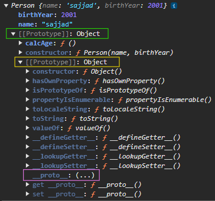

Here are simplified pseudocode examples for the Object-Oriented Programming (OOP) concepts discussed in the lecture.

# Object-Oriented Programming (OOP) Overview

## What is OOP?

- **Definition**: OOP is a programming paradigm based on the concept of "objects" that encapsulate data and behavior.
- **Purpose**: To model real-world entities, making code more flexible and easier to maintain.
- **Code examples** : Code examples in this article are sudo codes just for simplicity and not real javaScript syntax

## Key Concepts

1. **Objects**: Self-contained pieces of code that include data (properties) and code (methods).
2. **Classes**: Blueprints for creating objects. Define what properties and methods an object will have.

## Fundamental Principles of OOP

1. **Abstraction**: Hiding complex implementation details while exposing only the necessary features.

   - **Example**: A phone's interface that allows users to make calls without needing to know how the internal components work.

   ```pseudocode
   CLASS Phone
       PROPERTY model

       METHOD makeCall(number)
           PRINT "Calling " + number
       END METHOD
   END CLASS
   ```

2. **Encapsulation**: Keeping properties and methods private within a class and exposing only what is necessary through a public interface (API).

   - **Example**: Using private properties to protect sensitive data.

   ```pseudocode
   CLASS User
       PROPERTY username
       PRIVATE PROPERTY password

       METHOD login(inputPassword)
           IF inputPassword = password THEN
               PRINT "Login successful!"
           ELSE
               PRINT "Invalid password."
           END IF
       END METHOD
   END CLASS
   ```

3. **Inheritance**: Mechanism for creating a new class using properties and methods of an existing class.

   - **Example**: A `Admin` class that inherits from a `User` class.

   ```pseudocode
   CLASS Admin INHERITS User
       METHOD deleteUser(user)
           PRINT "User " + user.username + " has been deleted."
       END METHOD
   END CLASS
   ```

4. **Polymorphism**: Ability for different classes to be treated as instances of the same class through a common interface, allowing for methods to be overridden.

   - **Example**: Different classes implementing a common method.

   ```pseudocode
   CLASS Animal
       METHOD speak()
           PRINT "Animal speaks"
       END METHOD
   END CLASS

   CLASS Dog INHERITS Animal
       METHOD speak()
           PRINT "Woof! Woof!"
       END METHOD
   END CLASS

   CLASS Cat INHERITS Animal
       METHOD speak()
           PRINT "Meow!"
       END METHOD
   END CLASS

   FUNCTION makeAnimalsSpeak(animals)
       FOR EACH animal IN animals
           animal.speak()
       END FOR
   END FUNCTION
   ```

## Conclusion

OOP is a powerful paradigm that helps organize and manage code effectively. The four fundamental principles—abstraction, encapsulation, inheritance, and polymorphism—help in building robust, maintainable, and scalable software applications. Understanding these concepts is essential for effective programming in OOP languages.

Here are comprehensive notes on Object-Oriented Programming (OOP) in JavaScript based on the lecture content, including key concepts and code examples.

# Object-Oriented Programming (OOP) in JavaScript

## Overview

- This lecture focuses on how OOP is implemented in JavaScript, distinguishing it from traditional OOP models.
- Key concepts include classes, instances, prototypes, and different ways to implement OOP in JavaScript.

## Key Concepts

1. **Classes and Instances**

   - A class is a blueprint for creating objects (instances).
   - **Instantiation**: The process of creating an instance from a class.

   **Example:**

   ```javascript
   class Car {
     constructor(brand, model) {
       this.brand = brand;
       this.model = model;
     }

     displayInfo() {
       console.log(`Car: ${this.brand} ${this.model}`);
     }
   }

   const myCar = new Car("Toyota", "Corolla");
   myCar.displayInfo(); // Car: Toyota Corolla
   ```

2. **Prototypes**

   - In JavaScript, all objects have a prototype from which they can inherit properties and methods.
   - **Prototypal Inheritance**: Mechanism where objects inherit from other objects.
   - The prototype contains methods (behavior) that are accessible to all objects linked to that prototype."

   **Example:**

   ```javascript
   function Animal(name) {
     this.name = name;
   }

   Animal.prototype.speak = function () {
     console.log(`${this.name} makes a noise.`);
   };

   const dog = new Animal("Dog");
   dog.speak(); // Dog makes a noise.
   ```

3. **Delegation**
   - Objects delegate behavior to their prototype. This means methods are not copied to the object but are accessible via the prototype.

## Implementing OOP in JavaScript

1. **Constructor Functions**

   - A traditional way to create objects using functions.

   **Example:**

   ```javascript
   function Person(name, age) {
     this.name = name;
     this.age = age;
   }

   Person.prototype.greet = function () {
     console.log(`Hello, my name is ${this.name}.`);
   };

   const john = new Person("John", 30);
   john.greet(); // Hello, my name is John.
   ```

2. **ES6 Classes**

   - Introduced in ECMAScript 2015, providing a more modern syntax for creating objects and handling inheritance.

   **Example:**

   ```javascript
   class Animal {
     constructor(name) {
       this.name = name;
     }

     speak() {
       console.log(`${this.name} makes a noise.`);
     }
   }

   class Dog extends Animal {
     speak() {
       console.log(`${this.name} barks.`);
     }
   }

   const dog = new Dog("Rex");
   dog.speak(); // Rex barks.
   ```

3. **Object.create()**

   - A method to create a new object with a specified prototype object.

   **Example:**

   ```javascript
   const animal = {
     speak() {
       console.log(`${this.name} makes a noise.`);
     },
   };

   const dog = Object.create(animal);
   dog.name = "Buddy";
   dog.speak(); // Buddy makes a noise.
   ```

## Conclusion

- The four principles of OOP—abstraction, encapsulation, inheritance, and polymorphism—remain relevant in JavaScript.
- Understanding prototypal inheritance and delegation is crucial for effectively implementing OOP in JavaScript.
- The different methods (constructor functions, ES6 classes, and `Object.create()`) provide flexibility when designing OOP systems.

Here are the revised notes, including the additional points you mentioned:

# Constructor Functions and the `new` Operator

## Introduction

- **Object-Oriented Programming (OOP)**: Implemented using constructor functions to create objects programmatically.
- **Constructor Function**: A regular function that creates an object when called with the `new` operator.

## Key Concepts

1. **Naming Convention**:

   - Constructor functions should start with a capital letter (e.g., `Person`).
   - This convention is followed by built-in constructors like `Array` and `Map`.

2. **Creating a Constructor Function**:
   - A constructor function is just a function that initializes an object.
   - It typically takes parameters that define the object's properties.
   - **Note**: You cannot create a constructor function using an arrow function; it must be a function declaration or a function expression.

## Example of a Constructor Function

```javascript
// Constructor function for creating a Person object
function Person(firstName, birthYear) {
  this.firstName = firstName; // Set the first name property
  this.birthYear = birthYear; // Set the birth year property
}

// Create a new Person object using the new operator
const jonas = new Person("Jonas", 1991);
console.log(jonas); // Output: Person { firstName: 'Jonas', birthYear: 1991 }
```

## Steps Involved When Using `new`

When calling a constructor function with the `new` operator, the following steps occur:

1. **Create an Empty Object**:

   - A new empty object is created.

2. **Call the Function**:

   - The constructor function is called, and the `this` keyword inside the function refers to the newly created object.
   - Essentially, when the function is called, within its execution context, the `this` keyword will point to the new empty object created in step one.

3. **Link to Prototype**:

   - The new object is linked to the prototype of the constructor function.

4. **Return the Object**:
   - The newly created object is automatically returned from the constructor function.

## Example of `new` Operator

```javascript
const matilda = new Person("Matilda", 2017);
const jack = new Person("Jack", 2020);

console.log(matilda); // Output: Person { firstName: 'Matilda', birthYear: 2017 }
console.log(jack); // Output: Person { firstName: 'Jack', birthYear: 2020 }
```

## Instance Properties

- Each object created from a constructor function has its own properties, known as instance properties.

## Checking Instances

- You can check if an object is an instance of a constructor using the `instanceof` operator.

```javascript
console.log(jonas instanceof Person); // Output: true
console.log(matilda instanceof Person); // Output: true
```

## Adding Methods to Constructor Functions

- **Avoid Adding Methods Directly in Constructor**: It's inefficient because each instance would carry its own copy of the method.
- Instead, use prototypes.

## Example of Adding Methods

```javascript
// Adding a method to the Person prototype
Person.prototype.calcAge = function () {
  console.log(2037 - this.birthYear);
};

jonas.calcAge(); // Output: 46
matilda.calcAge(); // Output: 20
```

## Conclusion

- **Constructor Functions**: A pattern used for creating objects in JavaScript.
- **New Operator**: Key to understanding how objects are created and initialized.
- **Prototype**: Used for adding methods that can be shared across instances, enhancing performance.

## Important Points

- Constructor functions simulate classes in JavaScript, even though JavaScript is not a class-based language.
- Understanding the four steps that occur when using the `new` operator is crucial for mastering object creation in JavaScript.

These revised notes now include the information about the inability to use arrow functions as constructor functions and the explanation of the `this` keyword within the context of function execution.

Here are the complete notes from the lecture on prototypes in JavaScript, now including your additional notes in the appropriate sections:

# Prototypes in JavaScript

## Introduction to Prototypes

- Prototypes allow objects in JavaScript to inherit properties and methods from other objects.
- **Key Point:** Each and every function in JavaScript automatically has a property called `prototype`, including constructor functions.

## Understanding the Prototype Property

- When you create an object using a constructor function, that object gets access to all the methods and properties defined on the constructor's prototype.
- **Key Point:** Every object created by a certain constructor function will inherit all the methods and properties defined on this prototype property.

```javascript
// Constructor function
function Person(firstName, birthYear) {
  this.firstName = firstName;
  this.birthYear = birthYear;
}

// Adding a method to the prototype
Person.prototype.calcAge = function () {
  console.log(2023 - this.birthYear);
};

// Creating an instance
const jonas = new Person("Jonas", 1991);
jonas.calcAge(); // Outputs: 32
```

## Prototypal Inheritance

- Objects created from the same constructor function share methods defined on the prototype.
- **Key Point:** Instead of creating methods inside the constructor, we use the prototype. This way, there exists only one copy of the function, and all objects created using this constructor function can reuse this function through inheritance.

```javascript
const matilda = new Person("Matilda", 1995);
const jack = new Person("Jack", 1990);

matilda.calcAge(); // Outputs: 28
jack.calcAge(); // Outputs: 33
```

## Accessing Prototype Properties

- Each object has a special property called `__proto__` that refers to its prototype.
- **Key Point:** Remember that the `this` keyword in each object is always set to the object that is calling the method.

```javascript
console.log(jonas.__proto__); // Outputs: Person { calcAge: [Function] }
console.log(jonas.__proto__ === Person.prototype); // Outputs: true
```

## Prototype Property Confusion

- **Key Point:** `Person.prototype` is actually not the prototype of the `Person` function itself. Instead, it is used as the prototype for all objects created with the `Person` constructor function.
- We can check this by using:

```javascript
console.log(Person.prototype.isPrototypeOf(jonas)); // Outputs: true
```

## Steps Involved When Using `new`

- Remember the steps involved when using `new`:
  1. A new empty object is created.
  2. The `this` keyword is set to this new object.
  3. The object is linked to the prototype of the constructor function. This creates a `__proto__` property and sets its value to the prototype property of the function being called.

```javascript
// This shows that jonas.__proto__ is linked to Person.prototype
console.log(jonas.__proto__ === Person.prototype); // Outputs: true
```

## Adding Properties to the Prototype

- You can also add properties to the prototype.

```javascript
Person.prototype.species = "Homo Sapiens";

console.log(jonas.species); // Outputs: Homo Sapiens
console.log(matilda.species); // Outputs: Homo Sapiens
```

## Distinguishing Own Properties from Prototype Properties

- Use `hasOwnProperty` to check if a property belongs to the object itself.

```javascript
console.log(jonas.hasOwnProperty("firstName")); // Outputs: true
console.log(jonas.hasOwnProperty("species")); // Outputs: false
```

## Summary

- Prototypes are a cornerstone of JavaScript's object-oriented nature.
- Understanding how to use prototypes effectively can help reduce memory usage and improve performance by sharing methods among instances.

## Conclusion

- Prototypes allow for efficient memory usage and method sharing in JavaScript, making them essential for object-oriented programming.

Here are the updated notes with your addition included:

# Prototypal Inheritance and The Prototype Chain

## Overview

- This lecture consolidates knowledge from previous videos into a cohesive understanding of prototypes and inheritance in JavaScript.
- We will explore the **Person** constructor function and how objects are linked through prototypes.

## The Person Constructor Function

- The **Person** constructor function has a `prototype` property, which is an object that contains methods and properties shared by all instances.
- **Key Point:** `Person.prototype` also has a constructor property.
- **Key Point:** `Person.prototype.constructor` references back to the **Person** function itself.

## Prototype Property

- **Person.prototype** is not the prototype of the **Person** function; instead, it is the prototype for all objects created via the **Person** constructor.

## Object Creation with the `new` Operator

1. When a function is called with the `new` operator:

   - A new empty object is created.
   - The `this` keyword in the function is set to this new object.
   - Properties defined using `this` are added to the new object.

2. The new object is linked to the constructor function's prototype property (`Person.prototype`).

3. The `__proto__` property of the new object points to `Person.prototype`.

4. The new object is returned from the function unless another object is explicitly returned.

## Example of Object Creation

```javascript
function Person(firstName, birthYear) {
  this.firstName = firstName;
  this.birthYear = birthYear;
}

const jonas = new Person("Jonas", 1991);
```

## Method Lookup

- When calling a method (e.g., `calcAge`) on an object (e.g., `jonas`), JavaScript first looks for that method on the object itself.
- If not found, it looks up the prototype chain.
- This behavior is known as **prototypal inheritance** or **delegation**.

## Prototype Chain

- The connection between an object and its prototype forms the **prototype chain**.
- If a property or method is not found on the object, JavaScript searches up the prototype chain until it reaches the end.
- **Object.prototype** is typically the top of the prototype chain, with its `__proto__` property pointing to `null`.

## Example of Prototype Chain

- If `jonas` does not have a method, JavaScript looks in `Person.prototype`, and then up to `Object.prototype`.



- Green : prototype of sajjad object
  `sajjad.__proto__`

- Yellow : prototype of **prototype of sajjad object** (Prototype property of object constructor)
  `sajjad.__proto__.__proto__`

- Pink : prototype of **prototype of prototype of sajjad object** (top of the chain so it's null)
  `sajjad.__proto__.__proto__.__proto__`

## The Importance of Prototypal Inheritance

- Prototypal inheritance allows for efficient memory usage, as methods are shared across instances rather than duplicated.
- This is crucial for performance, especially when dealing with many objects.

## Conclusion

- The prototype chain is similar to the scope chain but focuses on properties and methods in objects.
- Understanding prototypes and inheritance is essential for effective JavaScript programming and will be further explored with concepts like class inheritance.

# Notes on Prototypal Inheritance and Prototype Chain in JavaScript

## Overview

This lecture covers prototypal inheritance and the prototype chain, specifically focusing on built-in objects like arrays.

## Key Concepts

## Prototypal Inheritance

- Every object in JavaScript has a prototype.
- Objects can inherit properties and methods from their prototype.

## The Prototype Chain

- The prototype chain is a series of links between objects and their prototypes.
- When a property or method is not found on an object, JavaScript looks up the prototype chain.

## Example: Person Object

```javascript
function Person(name) {
  this.name = name;
}

Person.prototype.greet = function () {
  console.log(`Hello, my name is ${this.name}`);
};

const jonas = new Person("Jonas");
jonas.greet(); // Outputs: Hello, my name is Jonas
```

- `jonas` inherits the `greet` method from `Person.prototype`.

## Accessing Prototypes

- You can access the prototype of an object using the `__proto__` property.

```javascript
console.log(jonas.__proto__); // Outputs: Person.prototype
```

## The Object Prototype

- The top of the prototype chain is `Object.prototype`, which provides basic methods like `hasOwnProperty`.

```javascript
console.log(jonas.hasOwnProperty("name")); // Outputs: true
```

## Inspecting Prototypes

- You can inspect an object's prototype chain using `console.dir()` in the console.

```javascript
console.dir(jonas); // Shows the prototype chain in the console
```

## Working with Arrays

## Array Prototype

- Arrays in JavaScript inherit methods from `Array.prototype`.

```javascript
const arr = [1, 2, 3];
console.log(arr.__proto__); // Outputs: Array.prototype
```

- Common array methods include `push`, `pop`, `filter`, etc.

## Example of Array Methods

```javascript
const numbers = [1, 2, 3, 4, 5];
const filtered = numbers.filter((num) => num > 2);
console.log(filtered); // Outputs: [3, 4, 5]
```

## Adding Methods to Array Prototype

- You can extend the Array prototype, but it's generally discouraged.

```javascript
Array.prototype.unique = function () {
  return [...new Set(this)];
};

const nums = [1, 2, 2, 3, 4, 4, 5];
console.log(nums.unique()); // Outputs: [1, 2, 3, 4, 5]
```

## Cautions Against Modifying Prototypes

1. **Future Compatibility:** Future versions of JavaScript may introduce methods with the same name, leading to conflicts.
2. **Team Collaboration:** Different team members may implement methods with the same name, creating bugs.

## Inspecting Built-in Objects

## Example: Inspecting DOM Elements

```javascript
const h1 = document.querySelector("h1");
console.dir(h1); // Displays the prototype chain of the selected element
```

- DOM elements are also objects and have their own prototype chains.

## Example: Function Prototypes

```javascript
function exampleFunction() {}
console.dir(exampleFunction); // Shows the function prototype
```

- Functions themselves are objects, inheriting from `Function.prototype`.

## Conclusion

- Understanding prototypal inheritance and the prototype chain is crucial for mastering JavaScript.
- While extending built-in prototypes is possible, it is advisable to avoid it in production code for maintainability and compatibility reasons.

# Understanding the DOM Tree Structure

1. **EventTarget**: A crucial interface that represents any object that can receive and handle events. This includes:

- Node
- Window

1. **Node**: The base class for all DOM objects. Every object in the DOM inherits from `Node`. This includes elements, text nodes, and comments.
2. **Element**: Inherits from `Node`. Represents an HTML or XML element.
3. **HTML Element**: A specific type of `Element`, such as `<div>`, `<h1>`, or `<span>`. Each HTML element inherits from `HTMLElement`.
4. **Specific Elements**: Each specific HTML tag, like `<h1>`, inherits from `HTMLHeadingElement`, which in turn inherits from `HTMLElement`.

## Prototype Chain of a DOM Element

Here's how the prototype chain typically looks for an `<h1>` element:

- `HTMLHeadingElement.prototype`
  - `HTMLElement.prototype`
  - `Element.prototype`
  - `Node.prototype`
  - `EventTarget.prototype`
  - `Object.prototype`

## Inspecting a DOM Element

When you select a DOM element using `document.querySelector()` and inspect it using `console.dir()`, you can observe this prototype chain.

## Example Code

```javascript
const h1 = document.querySelector("h1");
console.dir(h1);
```

## Breakdown of the Prototype Chain

- **`h1`**: This object represents the `<h1>` element in the DOM.
- **`__proto__`**: You can access the prototype of `h1` using `h1.__proto__`. This will show you that it inherits from `HTMLHeadingElement.prototype`.
- **`HTMLHeadingElement.prototype`**: This prototype includes methods and properties specific to `<h1>` elements, such as `align`, `innerText`, etc.
- **`HTMLElement.prototype`**: Inherits from `HTMLHeadingElement.prototype`. It includes methods and properties common to all HTML elements, such as `setAttribute`, `getAttribute`, etc.
- **`Element.prototype`**: This prototype contains methods applicable to all DOM elements, like `appendChild`, `removeChild`, etc.
- **`Node.prototype`**: This prototype includes methods for traversing the DOM tree, like `parentNode`, `childNodes`, etc.
- **`EventTarget.prototype`**: Provides methods for event handling, such as `addEventListener`, `removeEventListener`, and `dispatchEvent`.
- **`Object.prototype`**: The ultimate prototype that provides basic methods like `toString`, `hasOwnProperty`, etc.

## Conclusion

By inspecting the prototype chain of DOM elements, you can see how they inherit properties and methods from their parent prototypes, including `EventTarget`. This allows elements within the DOM tree to handle events efficiently, promoting interactivity in web applications. Understanding this structure is essential for effective DOM manipulation and for writing efficient JavaScript code that interacts with the webpage.

# ES6 Classes

## Overview

- JavaScript classes are syntactic sugar over prototypal inheritance.
- They allow for a more modern and understandable syntax, especially for those coming from other object-oriented programming languages.

## Key Points

1. **Classes vs. Traditional Classes**:

   - JavaScript classes do not work like traditional classes in languages such as Java or C++.
   - They still implement prototypal inheritance behind the scenes.

2. **Class Declaration**:

   - **Classes as Functions** : Classes in JavaScript are just a special type of function, which means we can define them using both class declarations and class expressions.

   - Syntax for declaring a class:
     ```javascript
     class PersonCl {
       // class body
     }
     ```

3. **Class Expressions**:
   - Classes can also be defined using expressions:
     ```javascript
     const PersonCl = class {
       // class body
     };
     ```

## Constructor Method

- The constructor method is a special method used for creating and initializing objects created within a class.
- It must be named `constructor`.
- Example:
  ```javascript
  class PersonCl {
    constructor(firstName, birthYear) {
      this.firstName = firstName;
      this.birthYear = birthYear;
    }
  }
  ```

## Creating Instances

- Instances of the class are created using the `new` keyword:
- When we create a new instance of a class using the new keyword, the constructor will be called, which initializes the new object. This new object will then be stored in the variable we assign it to.

  ```javascript
  const jessica = new PersonCl("Jessica", 1990);
  ```

  in this case, the constructor will be called, and a new object will be created and stored in the variable jessica.

## Setting Properties

- Properties can be set within the constructor using the `this` keyword:
  ```javascript
  class PersonCl {
    constructor(firstName, birthYear) {
      this.firstName = firstName;
      this.birthYear = birthYear;
    }
  }
  ```

## Adding Methods

- Methods can be added directly within the class body:

  ```javascript
  class PersonCl {
    constructor(firstName, birthYear) {
      this.firstName = firstName;
      this.birthYear = birthYear;
    }

    calcAge() {
      console.log(2024 - this.birthYear);
    }
  }
  ```

## Prototypal Inheritance

- Methods defined in the class are added to the prototype, not to the object instances:
  ```javascript
  const jessica = new PersonCl("Jessica", 1990);
  jessica.calcAge(); // Outputs: 34
  ```

## Checking the Prototype

- To check the prototype of an instance:
  ```javascript
  console.log(jessica.__proto__ === PersonCl.prototype); // true
  ```

## Adding Methods to Prototype Manually

- Methods can also be added to the prototype after the class is defined:

  ```javascript
  PersonCl.prototype.greet = function () {
    console.log(`Hey, my name is ${this.firstName}`);
  };

  jessica.greet(); // Outputs: "Hey, my name is Jessica"
  ```

## Important Class Features

1. **Classes are not hoisted**: Unlike function declarations, classes cannot be used before they are declared.
2. **Classes are first-class citizens**: Classes can be passed into and returned from functions because they are actually functions. This allows for greater flexibility in programming.
3. **Strict mode**: The body of a class is always executed in strict mode.

## Conclusion

- Classes provide a clearer and more structured way to implement object-oriented programming in JavaScript.
- Understanding function constructors and prototypes is essential before fully embracing classes.

# Notes on Setters and Getters in JavaScript

## Overview

- Getters and setters are special methods that allow us to access and update object properties in a controlled way.
- They are common in all JavaScript objects and provide a way to define computed properties.

## Key Concepts

### 1. Definitions

- **Getter**: A method that gets a property value.
- **Setter**: A method that sets a property value.

### 2. Assessor vs. Data Properties

- Getters and setters are known as **assessor properties**.
- Normal properties are referred to as **data properties**.

### 3. Syntax for Getters and Setters

- Getters and setters are defined within an object literal or class using the `get` and `set` keywords.

## Example: Object Literal

### Creating an Object with Getters and Setters

```javascript
const account = {
  owner: "Jonas",
  movements: [200, 300, -100, 500],

  // Getter for latest movement
  get latest() {
    return this.movements[this.movements.length - 1];
  },

  // Setter for adding a new movement
  set latest(movement) {
    this.movements.push(movement);
  },
};

// Using the getter
console.log(account.latest); // Outputs: 500

// Using the setter
account.latest = 100; // Adds 100 to movements
console.log(account.movements); // Outputs: [200, 300, -100, 500, 100]
```

### 4. Benefits of Getters and Setters

- They allow for computed properties, data validation, and encapsulation of data logic.
- Getters can perform calculations or transformations before returning a value.

## Example: Class with Getters and Setters (Data validation)

```js
class Person {
  constructor(fullName, birthYear) {
    // This will call the fullName setter and pass the fullName to it.
    this.fullName = fullName;
    this.birthYear = birthYear;
  }

  set fullName(name) {
    // We create a setter for a property that already exists.
    // Each time this.fullName is executed, the setter method will be called.
    if (name.includes(" ")) {
      // Check if the name contains a space
      this._fullName = name; // Set the private variable to avoid conflict with the setter
    } else {
      alert(
        "This is not a full name. Please include a space between first and last names."
      );
    }
  }

  // Create a getter to retrieve the fullName each time we access it.
  get fullName() {
    return this._fullName; // Return the private variable
  }
}

// Example Usage
const jessica = new Person("Jessica Davis", 1996);
console.log(jessica.fullName); // Outputs: "Jessica Davis"

// Attempting to set an invalid full name
jessica.fullName = "Jessica"; // Alerts: "This is not a full name. Please include a space between first and last names."
console.log(jessica.fullName); // Still outputs: "Jessica Davis"

// Setting a valid full name
jessica.fullName = "Jessica Thompson"; // Updates _fullName
console.log(jessica.fullName); // Outputs: "Jessica Thompson"
```

- **Single Parameter Requirement**: A setter must have exactly one parameter.

### 5. Important Notes

1. **Setter Invocation**: When creating a new instance, the setter for `fullName` is called with the provided name.
2. **Avoiding Infinite Loops**: Using `this._fullName` prevents recursive calls that can lead to infinite loops.
3. **Data Validation**: The setter checks if the name contains a space, ensuring it represents a full name.
4. **Getter Implementation**: The getter allows access to the private `_fullName` property without exposing it directly.
5. **Property Conflict**: The setter is created for a property that already exists, meaning that each time the code `this.fullName = fullName` is executed, the setter method will be invoked, allowing for controlled assignment of the `fullName`.

This structure allows for effective data validation and encapsulation in the `Person` class, ensuring that the full name is always in the correct format when set.

## Conclusion

- Getters and setters provide a powerful way to manage object properties in JavaScript.
- They enable data validation and computed properties, enhancing encapsulation and the overall design of your code.

# Notes on Static Methods in JavaScript

## Overview

Static methods are functions that belong to a class or constructor and are not accessible through individual instances. They are often used as helper functions that are related to the class but do not require access to instance properties.

## Key Concepts

### 1. Definition of Static Methods

- Static methods are called on the class itself rather than on instances of the class.
- They do not have access to instance properties or methods.

### 2. Example: Using Static Methods

A common example of static methods is the built-in `Array.from()` method, which converts array-like structures into actual arrays.

#### Example with `Array.from()`

```javascript
const nodeList = document.querySelectorAll("div"); // This returns a NodeList
const array = Array.from(nodeList); // Converts NodeList to an Array
console.log(array); // Outputs an array of div elements
```

### 3. Implementing Static Methods in Constructor Functions

You can define static methods directly on a constructor function.

#### Example: Constructor Function with Static Method

```javascript
function Person(name) {
  this.name = name;
}

// Adding a static method
Person.greet = function () {
  console.log("Hello from the Person class!");
};

// Usage
Person.greet(); // Outputs: "Hello from the Person class!"
```

### 4. Implementing Static Methods in Classes

Static methods can also be defined within ES6 class syntax using the `static` keyword.

#### Example: Class with Static Method

```javascript
class Person {
  constructor(name) {
    this.name = name;
  }

  // Static method
  static greet() {
    console.log("Hello from the Person class!");
  }
}

// Usage
Person.greet(); // Outputs: "Hello from the Person class!"
```

### 5. Accessing the `this` Keyword

- In static methods, `this` refers to the class itself, not to any instance. The class itself is the object that calls the method.

#### Example: Using `this` in a Static Method

```javascript
class Calculator {
  static multiply(a, b) {
    return a * b;
  }

  static describe() {
    console.log(
      `This is a Calculator class. The multiply method can multiply two numbers.`
    );
  }
}

// Usage
console.log(Calculator.multiply(5, 3)); // Outputs: 15
Calculator.describe(); // Outputs: "This is a Calculator class. The multiply method can multiply two numbers."
```

### 6. Limitations of Static Methods

- We cannot use static methods with instances of the constructor or class because they are not in the prototype of the class. Thus, instances cannot inherit static methods, as they exist in the namespace of the class itself.

```javascript
const john = new Person("John");
// john.greet(); // This will throw an error: john.greet is not a function
```

### 7. Use Cases for Static Methods

- Static methods are useful for utility functions that are related to the class but do not need to operate on instance data.
- They can help keep your code organized and modular.

## Conclusion

Static methods provide a way to create functions that are related to a class or constructor but are not tied to individual instances. They are useful for utility functions and help maintain clean and organized code.

# `Object.create` in JavaScript

## Overview

In this lecture, we explore a third way to implement prototypal inheritance in JavaScript using the `Object.create` method. This approach differs from constructor functions and ES6 classes.

## Key Concepts

### 1. Prototypal Inheritance

- Prototypal inheritance allows objects to inherit properties and methods from other objects.
- `Object.create` enables manual setting of an object's prototype without using constructor functions or the `new` operator.

### 2. Using `Object.create`

- `Object.create` creates a new object with a specified prototype object.
- It does not involve prototype properties or constructor functions, making it a different approach to inheritance.

### 3. Creating a Prototype Object

- To demonstrate, we create a prototype object for `Person` called `PersonProto`.

#### Example: Defining the Prototype Object

```javascript
const PersonProto = {
  calcAge: function () {
    console.log(2023 - this.birthYear);
  },
};
```

### 4. Creating a New Object

- With `PersonProto` defined, we can create a new `Person` object, such as `Steven`, using `Object.create`.

#### Example: Creating an Object with `Object.create`

```javascript
const Steven = Object.create(PersonProto);
```

- This creates a new object `Steven` linked to `PersonProto`.

### 5. Adding Properties to the Object

- We can add properties to `Steven` just like a normal object.

#### Example: Adding Properties

```javascript
Steven.name = "Steven";
Steven.birthYear = 1990;
```

### 6. Using Methods from the Prototype

- The newly created object can access methods defined in its prototype.

#### Example: Calling a Method

```javascript
Steven.calcAge(); // Outputs: 33 (assuming current year is 2023)
```

### 7. Understanding the Prototype Chain

- The prototype chain allows the `Steven` object to access properties and methods from `PersonProto`.

#### Example: Checking the Prototype

```javascript
console.log(Steven.__proto__ === PersonProto); // true
```

### 8. Creating Another Object

- We can create additional objects using the same prototype.

#### Example: Creating Another Object

```javascript
const Sarah = Object.create(PersonProto);
Sarah.name = "Sarah";
Sarah.birthYear = 1995;
Sarah.calcAge(); // Outputs: 28
```

### 9. Initializing Objects Programmatically

- To avoid manual property assignment, we can implement an `init` method to initialize properties.

#### Example: `init` Method

```javascript
const PersonProto = {
  calcAge: function () {
    console.log(2023 - this.birthYear);
  },
  init: function (name, birthYear) {
    this.name = name;
    this.birthYear = birthYear;
  },
};

const Sarah = Object.create(PersonProto);
Sarah.init("Sarah", 1995);
Sarah.calcAge(); // Outputs: 28
```

### 10. Summary of `Object.create`

- `Object.create` creates a new object with the specified prototype.
- It provides a straightforward way to implement prototypal inheritance without constructor functions.
- Understanding how `Object.create` works is crucial for implementing inheritance in JavaScript.

## Conclusion

`Object.create` is a powerful tool for creating objects with a specific prototype, allowing for flexible and clear inheritance patterns in JavaScript. It lays the foundation for understanding more complex object-oriented programming concepts that will be explored in future lectures.

# Notes on Inheritance Between Classes Using Constructor Functions

## Overview

- The lecture discusses prototypal inheritance in JavaScript, focusing on creating a class hierarchy using constructor functions.

## Key Concepts

1. **Prototypal Inheritance**: Objects inherit methods from their prototypes.
2. **Real Inheritance**: Focus on class-based inheritance where one class inherits from another.
3. We implement inheritance in JavaScript through prototype inheritance, where the prototype of a child class should be the prototype of the parent class. This allows instances of the child class to access the methods of the parent class.

## Class Structure

- **Parent Class**: `Person`
- **Child Class**: `Student` (inherits from `Person`)

### 1. Constructor Function for Person

```javascript
function Person(firstName, birthYear) {
  this.firstName = firstName;
  this.birthYear = birthYear;
}

// Method to calculate age
Person.prototype.calcAge = function () {
  console.log(2023 - this.birthYear);
};
```

### 2. Constructor Function for Student

- The `Student` constructor function calls the `Person` constructor to inherit properties.

```javascript
function Student(firstName, birthYear, course) {
  Person.call(this, firstName, birthYear); // Inherit properties
  this.course = course;
}
```

Here's the revised version with improved style and formatting for better clarity and readability:

### 3. Setting Up Inheritance

To establish inheritance, we use `Object.create` to set up the prototype chain properly.

#### Steps:

1. **Set the Prototype Chain**:

   ```javascript
   Student.prototype = Object.create(Person.prototype);
   ```

   - This creates a new object whose prototype is `Person.prototype`. As a result, `Student.prototype` inherits from `Person.prototype`.

2. **Correct the Constructor Reference**:
   ```javascript
   Student.prototype.constructor = Student;
   ```
   - After setting up the prototype chain, the `constructor` property of `Student.prototype` still points to `Person`. This step ensures that `Student.prototype.constructor` points back to `Student`.

#### Why Not Use Direct Assignment?

Avoid this approach:

```javascript
Student.prototype = Person.prototype;
```

- **Problem**: Both `Student.prototype` and `Person.prototype` would then refer to the same object.
- **Implications**:
  - Any changes made to `Student.prototype` would also affect `Person.prototype`.
  - For instance, adding a method to `Student.prototype` would make it available on `Person.prototype`, which is undesirable.
  - Creating a new instance of `Student` would reference the same prototype as `Person`, leading to potential bugs and side effects.

By using `Object.create`, we maintain a clean and correct prototype chain, ensuring proper inheritance without unintended consequences.

### 4. Adding Methods to Student

- Add methods specific to the `Student` class.

```javascript
Student.prototype.introduce = function () {
  console.log(`My name is ${this.firstName} and I study ${this.course}.`);
};
```

### 5. Creating Instances

- Create an instance of `Student` and use inherited and own methods.

```javascript
const mike = new Student("Mike", 2020, "Computer Science");
mike.introduce(); // "My name is Mike and I study Computer Science."
mike.calcAge(); // 3 (assuming the current year is 2023)
```

## Summary

- The lecture emphasizes the importance of setting up the prototype chain correctly to enable inheritance.
- The `Student` class can access methods from the `Person` class through the prototype chain, demonstrating the power of inheritance in JavaScript.

# Notes on Inheritance Between Classes Using ES6 Classes

## Overview

- This lecture covers how to implement inheritance using ES6 class syntax, in contrast to constructor functions.

## Key Concepts

1. **Class Syntax**: ES6 introduces a simpler and more intuitive way to create classes and handle inheritance.
2. **Ingredients for Inheritance**: The `extends` keyword and the `super` function.

## Class Structure

- **Parent Class**: `Person`
- **Child Class**: `Student` (inherits from `Person`)

### 1. Defining the Parent Class

```javascript
class Person {
  constructor(firstName, birthYear) {
    this.firstName = firstName;
    this.birthYear = birthYear;
  }

  calcAge() {
    console.log(2023 - this.birthYear);
  }
}
```

### 2. Defining the Child Class

- Use the `extends` keyword to inherit from the `Person` class.

```javascript
class Student extends Person {
  constructor(firstName, birthYear, course) {
    super(firstName, birthYear); // Call the parent class constructor
    this.course = course;
  }

  introduce() {
    console.log(`My name is ${this.firstName} and I study ${this.course}.`);
  }
}
```

- If the child class has no additional properties beyond those inherited from the parent class, you can omit the constructor entirely. The parent class's constructor will automatically be called:

```javascript
class Student extends Person {
  // No constructor needed if no new properties are added
}
```

### 3. Creating Instances

- Create an instance of the `Student` class and use inherited and own methods.

```javascript
const martha = new Student("Martha", 2012, "Computer Science");
martha.introduce(); // "My name is Martha and I study Computer Science."
martha.calcAge(); // 11 (assuming the current year is 2023)
```

## Understanding the `super` Function

- The `super` function calls the constructor of the parent class and initializes inherited properties.
- Here, `super(firstName, birthYear)` invokes the `Person` constructor, setting `this.firstName` and `this.birthYear` in the `Student` instance.
- It must be called before using `this` in the child class constructor.

```javascript
class Student extends Person {
  constructor(firstName, birthYear, course) {
    super(firstName, birthYear); // Must be called first
    this.course = course;
  }
}
```

## Method Overriding

- You can override methods from the parent class by defining a new method with the same name in the child class.

```javascript
class Student extends Person {
  calcAge() {
    const age = 2023 - this.birthYear;
    console.log(
      `I'm ${age} years old, but I feel like ${
        age + 10
      } years old as a student.`
    );
  }
}
```

### 4. Creating a New Instance with Overridden Method

```javascript
const john = new Student("John", 2000, "Mathematics");
john.calcAge(); // "I'm 23 years old, but I feel like 33 years old as a student."
```

## Summary

- The ES6 class syntax simplifies the process of inheritance through the use of `extends` and `super`.
- Classes can inherit properties and methods from parent classes, and methods can be overridden in child classes.
- If no additional properties are required in the child class, you can omit the constructor and rely on the parent class's constructor.
- Understanding these concepts is vital for leveraging inheritance effectively in JavaScript.

# Inheritance Using `Object.create`

## Overview

- This lecture focuses on using `Object.create` to implement a complex prototype chain, allowing for inheritance without classes.

## Key Concepts

1. **Prototype Chain**: Establishing a relationship between objects using prototypes.
2. **Object.create**: A method that creates a new object, using an existing object as its prototype.

## Steps to Implement Inheritance

### 1. Creating the Parent Prototype

- Define a prototype object that will serve as the base for other objects.

```javascript
const PersonProto = {
  init(firstName, birthYear) {
    this.firstName = firstName;
    this.birthYear = birthYear;
  },
  calcAge() {
    console.log(new Date().getFullYear() - this.birthYear);
  },
};
```

### 2. Creating the Student Prototype

- Create a new prototype for students that inherits from `PersonProto`.

```javascript
const StudentProto = Object.create(PersonProto);
StudentProto.init = function (firstName, birthYear, course) {
  PersonProto.init.call(this, firstName, birthYear); // Call parent init
  this.course = course;
};
StudentProto.introduce = function () {
  console.log(`My name is ${this.firstName} and I study ${this.course}.`);
};
```

### 3. Creating Instances

- Use `Object.create` to create a new student object that inherits from `StudentProto`.

```javascript
const jay = Object.create(StudentProto);
jay.init("Jay", 2010, "Computer Science"); // Initialize properties
jay.introduce(); // "My name is Jay and I study Computer Science."
jay.calcAge(); // Outputs current age based on birth year
```

## Understanding the Prototype Chain

- The prototype chain is established as follows:
  - `jay` → `StudentProto` → `PersonProto`
- This means `jay` can access methods defined in both `StudentProto` and `PersonProto`.

### 4. Adding Methods and Properties

- You can add additional methods to `StudentProto` or `PersonProto` as needed.

```javascript
StudentProto.calcAge = function () {
  console.log(`I'm ${new Date().getFullYear() - this.birthYear} years old.`);
};
```

### 5. Example Usage

```javascript
const alice = Object.create(StudentProto);
alice.init("Alice", 2005, "Mathematics");
alice.introduce(); // "My name is Alice and I study Mathematics."
alice.calcAge(); // Outputs current age
```

## Summary

- Using `Object.create` allows for a more straightforward and flexible way to implement inheritance in JavaScript.
- This method avoids the complexity of traditional constructor functions and ES6 classes, focusing on linking objects directly.
- Understanding these prototype-based patterns is essential for working effectively with JavaScript's object-oriented capabilities.

# Encapsulation, Protected Properties, and Methods in JavaScript

## Overview

This lecture discusses the principle of encapsulation in object-oriented programming, emphasizing the importance of data privacy and how to implement protected properties and methods in JavaScript.

## Key Concepts

### 1. **Encapsulation**

- Encapsulation is the practice of keeping certain properties and methods private within a class to prevent external manipulation.
- A public interface (API) is exposed for interaction, while internal details remain hidden.

### 2. **Reasons for Encapsulation**

- **Prevent Accidental Manipulation**: Protects internal data from being altered unintentionally by external code.
- **Safe Internal Changes**: A small public API allows internal methods to change without breaking external code dependencies.

## Implementation of Encapsulation in JavaScript

### 1. Class Definition with Protected Properties

To demonstrate encapsulation, we'll create a class that uses protected properties by convention.

```javascript
class Account {
  constructor(owner, currency, pin) {
    this.owner = owner; // Public property
    this.currency = currency; // Public property
    this._pin = pin; // Protected property (by convention)
    this._movements = []; // Protected property (by convention)
  }

  // Method to deposit money
  deposit(value) {
    this._movements.push(value);
  }

  // Method to withdraw money
  withdraw(value) {
    this.deposit(-value); // Use deposit method for withdrawals
  }

  // Method to get movements
  getMovements() {
    return this._movements; // Return movements safely
  }

  // Method to request a loan (protected)
  _approveLoan(value) {
    // Logic to approve a loan
    return true; // Placeholder for approval logic
  }

  // Public method to request a loan
  requestLoan(value) {
    if (this._approveLoan(value)) {
      this.deposit(value); // Deposit loan amount
      console.log("Loan approved!");
    }
  }
}
```

### 2. Creating an Instance

Instantiate the `Account` class and use its methods.

```javascript
const acc1 = new Account("Jonas", "EUR", 1111);

// Using the deposit and withdraw methods
acc1.deposit(250);
acc1.withdraw(140);

// Accessing movements through the public method
console.log(acc1.getMovements()); // Outputs: [250, -140]
```

### 3. Protected Properties and Methods

- Properties prefixed with an underscore (e.g., `_movements`, `_pin`) indicate they are intended to be protected.
- While these properties are still accessible externally, the convention suggests they should not be directly manipulated.

### 4. Accessing Protected Properties

Although it's possible to access protected properties, doing so is discouraged.

```javascript
console.log(acc1._movements); // Accessible, but not recommended
```

### 5. Public API

The public API consists of methods that allow interaction without exposing sensitive data directly.

```javascript
// Public methods
acc1.requestLoan(1000); // Requesting a loan
console.log(acc1.getMovements()); // Verify movements after loan
```

## Summary

- Encapsulation is crucial for maintaining data integrity in object-oriented programming.
- JavaScript does not natively support private data, but developers can use conventions (like prefixing with an underscore) to indicate protected properties.
- Implementing a public API allows safe interaction with class instances while preventing direct manipulation of sensitive data.

Here are the notes from the lecture on encapsulation with private class fields and methods in JavaScript, along with relevant code examples.

# Encapsulation in JavaScript (New method)

## Overview

- **Public and Private Members**: JavaScript introduces the concept of public and private fields/methods, moving beyond constructor functions.

### Key Terms

- **Fields**: Properties of a class. In traditional OOP, they're often called fields instead of properties.
- **Methods**: Functions that belong to a class.

### Types of Fields and Methods

1. **Public Fields**
2. **Private Fields**
3. **Public Methods**
4. **Private Methods**

### 1. Public Fields

- Public fields are accessible on all instances of a class.

```javascript
class Account {
  locale = navigator.language; // Public field Outside of the constructor
  constructor() {
    // Other constructor logic
  }
}
```

### 2. Private Fields

- Private fields are truly private and not accessible from outside the class.
- Syntax: Prefix field names with `#`.

```javascript
class Account {
  #movements = []; // Private field
  #pin; // Private field initialized with the constructor parameter and we can not initilize it here
  constructor(pin) {
    // Set the private pin field using the constructor parameter
    this.pin = pin;
  }

  addMovement(movement) {
    this.#movements.push(movement); // Accessing private field within class
  }
}

// Example usage
const account = new Account();
account.addMovement(100);
console.log(account.#movements); // SyntaxError: Private field '#movements' must be declared in an enclosing class
```

### 3. Public Methods

- Public methods are accessible from outside the class.
- difine like a normal method in class

```javascript
class Account {
  addMovement(movement) {
    this._movements.push(movement); // Using public field
  }
}
```

### 4. Private Methods

- Private methods hide implementation details.
- Syntax: Prefix method names with `#`.

```javascript
class Account {
  #approveLoan() {
    // Logic for approving a loan
  }

  requestLoan(amount) {
    if (this.#approveLoan()) {
      // Logic for loan request
    }
  }
}

// Example usage
const account = new Account();
account.requestLoan(1000); // Cannot call #approveLoan directly
```

### Static Fields and Methods

- Static members belong to the class itself, not instances. and they can be public and private

```javascript
class Account {
  static helper() {
    console.log("This is a static method");
  }
}

// Example usage
Account.helper(); // Call static method on class
```

### Conclusion

- The introduction of public and private fields/methods enhances encapsulation in JavaScript, allowing for better control over class properties and methods.
- Use the `#` syntax for private members, and remember that static methods can only be called on the class itself.

This summary captures key points and code examples from the lecture on encapsulation in JavaScript.
Here are the notes from the lecture on chaining methods in JavaScript, along with relevant code examples.

# Notes on Chaining Methods in JavaScript

### Overview
- **Chaining Methods**: Similar to chaining array methods (like `filter`, `map`, and `reduce`), you can implement chaining in your class methods to allow multiple method calls in a single line.

## Key Concept
- To make a method chainable, return the object (`this`) at the end of the method.

## Example Implementation

### Step 1: Basic Class Setup
Start with a simple class structure where methods will modify the class properties.

```javascript
class Account {
    #movements = []; // Private field for storing movements
    #pin; // Private field for PIN

    constructor(pin) {
        this.#pin = pin; // Initialize the private PIN
    }
}
```

### Step 2: Implementing Chainable Methods

1. **Deposit Method**:
   - Modify the deposit method to return the current object (`this`) after adding a movement.

```javascript
deposit(amount) {
    this.#movements.push(amount); // Add amount to movements
    return this; // Return the current object for chaining
}
```

2. **Withdraw Method**:
   - Similarly, make the withdraw method chainable.

```javascript
withdraw(amount) {
    this.#movements.push(-amount); // Subtract amount from movements
    return this; // Return the current object for chaining
}
```

3. **Request Loan Method**:
   - Implement the loan request method as chainable.

```javascript
requestLoan(amount) {
    // Logic to approve a loan (simplified)
    if (this.#approveLoan(amount)) {
        this.deposit(amount); // Deposit loan amount
        return this; // Return the current object for chaining
    }
}
```

4. **Private Method for Loan Approval**:
   - A private method to handle loan approval logic.

```javascript
#approveLoan(amount) {
    // Logic to check if loan can be approved
    return true; // Simplified for demonstration
}
```

### Step 3: Using Chained Methods

Now you can use the methods in a chain:

```javascript
const account = new Account(1234);
account.deposit(300)
       .deposit(500)
       .withdraw(35)
       .requestLoan(25000)
       .withdraw(4000);
```

## Conclusion
- By returning `this` in methods that modify properties, you enable method chaining, allowing for a more fluid and expressive syntax.
- This technique is particularly useful for methods that set or modify properties, enhancing code readability and efficiency.

## Additional Practice
- Experiment with creating your own classes and implementing method chaining to reinforce understanding.

